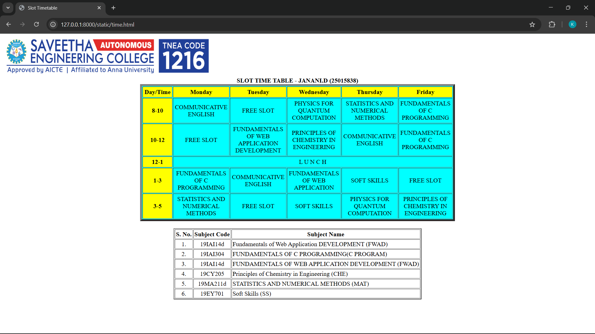

# Ex03 Time Table
## Date:

## AIM
To write a html webpage page to display your slot timetable.

## ALGORITHM
### STEP 1
Create a Django-admin Interface.

### STEP 2
Create a static folder and inert HTML code.

### STEP 3
Create a simple table using ```<table>``` tag in html.

### STEP 4
Add header row using ```<th>``` tag.

### STEP 5
Add your timetable using ```<td>``` tag.

### STEP 6
Execute the program using runserver command.

## PROGRAM
```
<!DOCTYPE html>
<html>
<head>
    <title>Slot Timetable</title>
</head>
<body>
    
    <br>
    <table align="center" width="540" cellspacing="2" cellpadding="4" border="5" bgcolor="pink">
        <caption><b>SLOT TIME TABLE - JANANI (25015838)</b></caption>
        <tr align="center">
            <th bgcolor="cyan">Day/Time</th>
            <th bgcolor="cyan">Monday</th>
            <th bgcolor="cyan">Tuesday</th>
            <th bgcolor="cyan">Wednesday</th>
            <th bgcolor="cyan">Thursday</th>
            <th bgcolor="cyan">Friday</th>
        </tr>
        <tr align="center">
            <th bgcolor="cyan">8-10</th>
            <td>PUBLIC SPEAKING</td>
            <td>INTRODUCTION OF DATA SCIENCE</td>
            <td>FUNDAMENTAL OF WEB APPLICATION DEVELOPMENT</td>
            <td>INTRODUTION OF MACHINE LEARNING</td>
            <td>FUNDAMENTALS OF C PROGRAMMING</td>
        </tr>
        <tr align="center">
            <th bgcolor="cyan">10-12</th>
            <td>FUNDAMENTAL OF C PROGRAMMING </td>
            <td>FUNDAMENTAL WEB APPLICATION DEVELOPMENT</td>
            <td>FREE SLOT</td>
            <td>PUBLIC SPEAKING</td>
            <td>INTRODUCTION OF DATA SCIENCE</td>
        </tr>

<tr align="center">
            <th bgcolor="cyan">12-1</th>
            <td colspan="5" align="center">L  U  N  C  H</td>
        </tr>
        <tr align="center">
            <th bgcolor="cyan">1-3</th>
            <td>INTRODUTION OF MACHINE LEARNING</td>
            <td>FUNDAMENTAL OF WEB APPLICATION</td>
            <td>PUBLIC SPEAKING</td>
            <td>FUNDAMENTAL OF C PROGRAMMING</td>
            <td>FREE SLOT</td>
        </tr>
        <tr align="center">
            <th bgcolor="cyan">3-5</th>
            <td>PUBLIC SPEAKING</td>
            <td>FREE SLOT</td>
            <td>FUNDAMENTALS OF WEB APPLICATION DEVELOPMENT</td>
            <td>INTRODUTION OF DATA SCIENCE</td>
            <td>FUNDAMENTAL OF C PROGRAMMING</td>
        </tr>
    </table>
</body>
</html>

<br>
<table align="center" cellspacing="2" cellpadding="2" border="2">
<tr align="center">
<th>S. No.</th>
<th>Subject Code</th>
<th>Subject Name</th>
</tr>
<tr>
<td align="center">1.</td>
<td align="center">20KY401</td>
<td>FUNDAMENTAL OF C PROGRAMMING (C PROGRAM)</td>
</tr>
<tr>
<td align="center">2.</td>
<td align="center">20KY402</td>
<td>INTRODUCTION OF DATA SCIENCE</td>
</tr>
<tr>
<td align="center">3.</td>
<td align="center">20KY403</td>
<td>FUNDAMENTALS OF WEB APPLICATION DEVELOPMENT (FWAD)</td>
</tr>
<tr>
<td align="center">4.</td>
<td align="center">20KY404</td>
<td>INTRODUCTION OF MACHINE LEARNING</td>
</tr>
<tr>
<td align="center">5.</td>
<td align="center">20KY405</td>
<td>STATISTICS AND NUMERICAL METHODS (MAT)</td>
</tr>
<tr>
<td align="center">6.</td>
<td align="center">20KY406</td>
<td>Soft Skills (SS)</td>
</tr>
</table>
</body>
```

## OUTPUT


## RESULT
The program for creating slot timetable using basic HTML tags is executed successfully.
